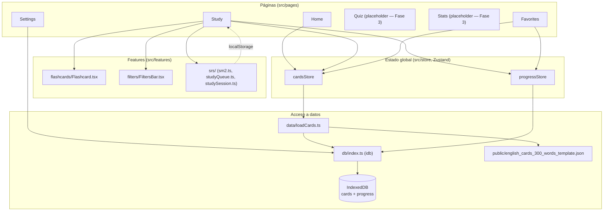

# Arquitectura — English Cards

App 100% cliente (sin backend): React renderiza la UI, Zustand mantiene el
estado en memoria durante la sesión, e IndexedDB persiste tarjetas y
progreso en el navegador. El dataset fuente es un JSON estático servido
desde `public/` y las imágenes son archivos estáticos también.

## Diagrama

## Capas

- **Páginas (`src/pages`)**: una por ruta de React Router (`/`, `/study`,
  `/quiz`, `/favorites`, `/stats`, `/settings`, montadas con `HashRouter`
  para compatibilidad con GitHub Pages). `Quiz` y `Stats` siguen como
  placeholders (Fase 3 del plan).
- **Features (`src/features`)**: lógica y componentes reutilizables por
  dominio, no atados a una página concreta:
  - `flashcards/Flashcard.tsx`: tarjeta con flip 3D (Framer Motion), audio
    TTS (`useSpeech`), toggle de favorito y navegación `‹ ›` junto al
    botón de escuchar.
  - `filters/FiltersBar.tsx`: filtro combinable por categoría, nivel y
    "solo favoritos".
  - `srs/`: motor de repetición espaciada —
    - `sm2.ts`: algoritmo SM-2 simplificado (recalcula `easeFactor`,
      `interval` y `dueDate` a partir de la respuesta Again/Hard/Good/Easy).
    - `studyQueue.ts`: arma el orden de la cola (vencidas primero, luego
      nuevas; filtradas por categoría/nivel/favoritos; barajadas dentro de
      cada grupo de prioridad).
    - `studySession.ts`: persiste en `localStorage` la cola y la posición
      actual (por combinación de filtros y por día), para que un refresh
      de página no vuelva a barajar ni a reiniciar el avance.
- **Store (`src/store`, Zustand)**:
  - `cardsStore`: carga y expone las 300 tarjetas del dataset.
  - `progressStore`: expone el progreso por tarjeta (`CardProgress`) y las
    acciones `answerCard`, `toggleFavorite`, `importProgress`.
- **Datos (`src/data`, `src/db`)**:
  - `loadCards.ts`: en el primer arranque hace `fetch` del JSON y lo
    escribe en IndexedDB; en arranques siguientes lee directo de
    IndexedDB.
  - `db/index.ts`: wrapper de la librería `idb` sobre dos object stores,
    `cards` (clave `id`) y `progress` (clave `cardId`).
- **Hooks (`src/hooks`)**: `useSpeech` envuelve la Web Speech API
  (`SpeechSynthesis`) para el audio TTS en inglés (`en-US`).

## Por qué no hay backend

Todo el estado vive en el navegador (IndexedDB); el único "servidor" es el
hosting estático de GitHub Pages sirviendo el `index.html`, el JSON y las
imágenes. El respaldo entre dispositivos se resuelve exportando/importando
el progreso como archivo `.json` (`Settings.tsx`), fusionando por
`cardId`/`updatedAt`, en vez de sincronización en la nube.
