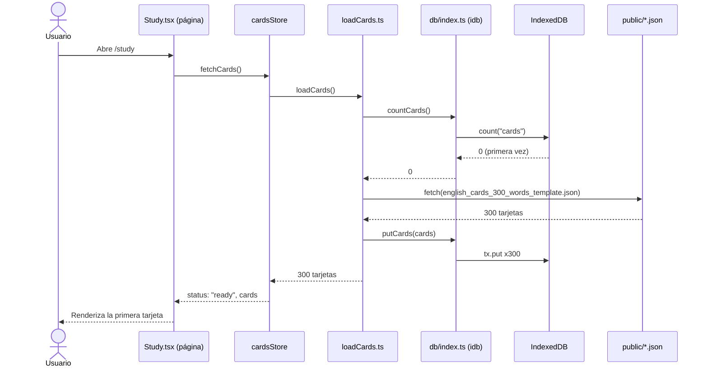
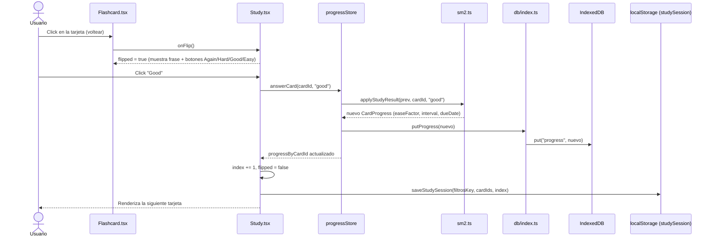
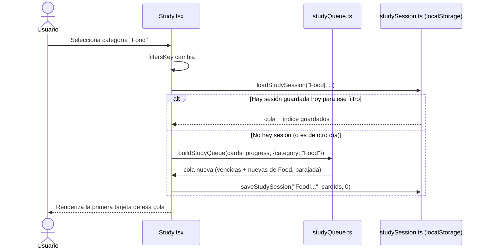
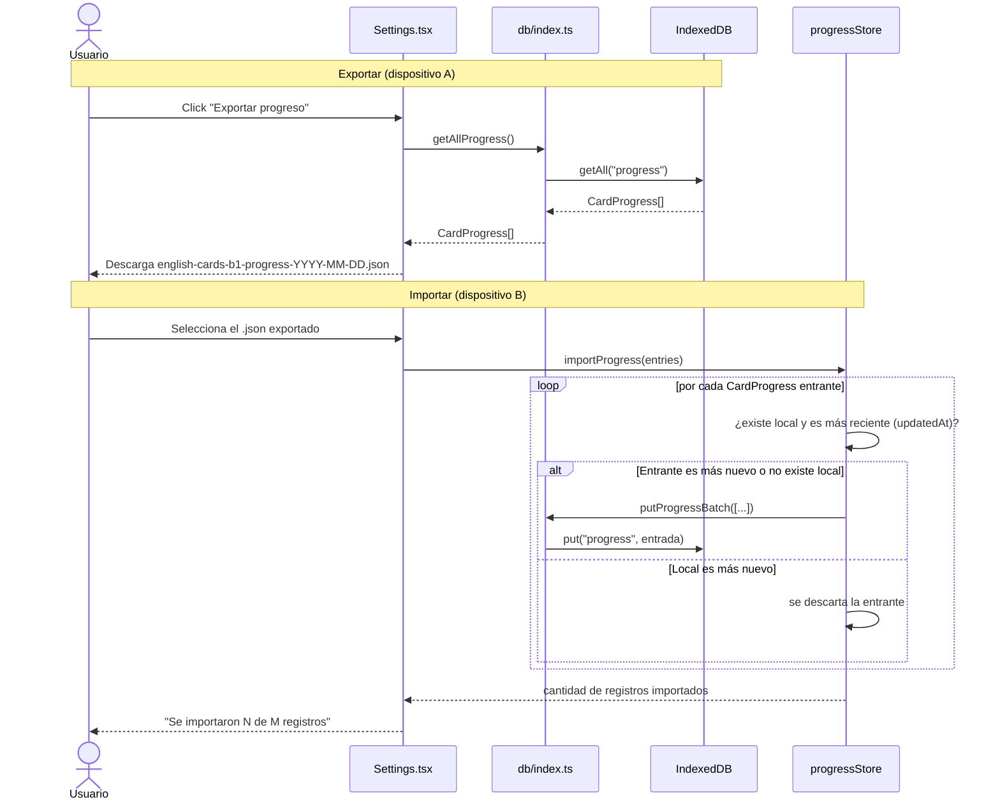

# Diagramas de secuencia — English Cards

Ver también [`architecture.md`](./architecture.md) para el mapa general de
capas y carpetas.

## 1. Primera carga de la app (hidratación del JSON a IndexedDB)

En arranques siguientes, `countCards()` devuelve 300 y `loadCards()` lee
directo de IndexedDB (`getAllCards()`) sin volver a pedir el JSON.

## 2. Estudiar una tarjeta y responder (SRS + persistencia)

Si la respuesta es "Again", `Study.tsx` no solo avanza el índice: reinserta
la misma tarjeta ~3 posiciones más adelante en la cola de la sesión actual
(no al final del día), para reforzarla pronto sin salir de la sesión.

## 3. Cambiar de filtro / refrescar la página

Sin filtros, `buildStudyQueue` incluye las 300 tarjetas (vencidas primero,
luego nuevas); con un filtro activo, solo el subconjunto que coincide —
sin un límite diario que oculte tarjetas en ninguno de los dos casos.

## 4. Exportar / importar progreso (respaldo manual entre dispositivos)

